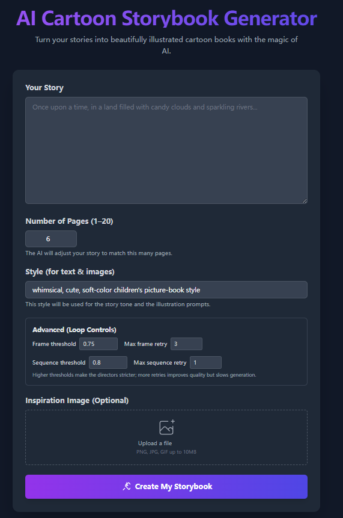

<div align="center">

</div>

# 📖 BookAgent  
**Orchestrating Safety-Aware Visual Narratives via Multi-Agent Cognitive Calibration**

[](https://arxiv.org/)  
[](https://github.com/bogao-code/BookAgent)

---

## 🚀 Overview

We introduce **BookAgent**, a safety-aware multi-agent framework for **end-to-end visual storybook generation**.  
Unlike prior pipelines that decouple text and image generation, BookAgent **jointly plans, generates, verifies, and repairs** multi-modal narratives.

> 💡 Unlike stage-wise pipelines, BookAgent introduces a **closed-loop cognitive generation paradigm** for long-horizon multi-modal storytelling.

---

## 🧠 Framework

<p align="center">
  
</p>

BookAgent is built upon a **closed-loop multi-agent architecture** with three key stages:

- **Value-Aligned Storyboarding (VAS)**  
  Ensures safety and transforms raw drafts into structured story plans.

- **Iterative Cross-modal Refinement (ICR)**  
  A generate–verify–revise loop that enforces **text-image grounding** and identity consistency.

- **Temporal Cognitive Calibration (TCC)**  
  Performs **global reasoning and selective repair** to maintain long-horizon consistency.

---

## 🖥️ Demo Interface

<p align="center">
  
</p>

We build a fully functional interactive system for storybook creation, supporting:

- ✏️ Story input and page control  
- 🎨 Style customization  
- 🔁 Iterative global refinement  
- 🧩 Character consistency via reference sheets  

---

## 🚀 Run Locally

This project includes a deployable web demo built with **Google AI Studio**.

👉 View the hosted app:  
https://ai.studio/apps/drive/1S6ouar2Cd7moBBV2Rm6jKT0qUQEEZf67

### Prerequisites
- Node.js

### Steps

1. Install dependencies:
   ```bash
   npm install
   ```

2. Set your API key in `.env.local`:
   ```bash
   GEMINI_API_KEY=your_api_key_here
   ```

3. Run the app:
   ```bash
   npm run dev
   ```

---

## ✨ Key Features

- 🔁 **Closed-loop generation (not one-shot)**
- 🎭 **Character identity consistency across pages**
- 🧠 **Multi-agent collaboration**
- 🛡️ **Child-safe content generation**
- 📚 **Long-horizon narrative reasoning**

---

## 📊 Results

BookAgent significantly improves:

- 📖 Narrative coherence  
- 🧍 Character consistency  
- 🛡️ Safety compliance  

compared to prior methods such as StoryGPT-V and MovieAgent.

---

## 🙏 Acknowledgements

We thank **Google AI Studio** for providing an intuitive platform for rapid prototyping and deployment of our interactive demo system.

---

## 🔗 Code

👉 https://github.com/bogao-code/BookAgent

---

## 📌 Citation

```bibtex
@article{gao2026bookagent,
  title={BookAgent: Orchestrating Safety-Aware Visual Narratives via Multi-Agent Cognitive Calibration},
  author={Gao, Bo and Liu, Chang and Miao, Yuyang and Ma, Siyuan and Lim, Ser-Nam},
  journal={ACL Findings},
  year={2026}
}
```
